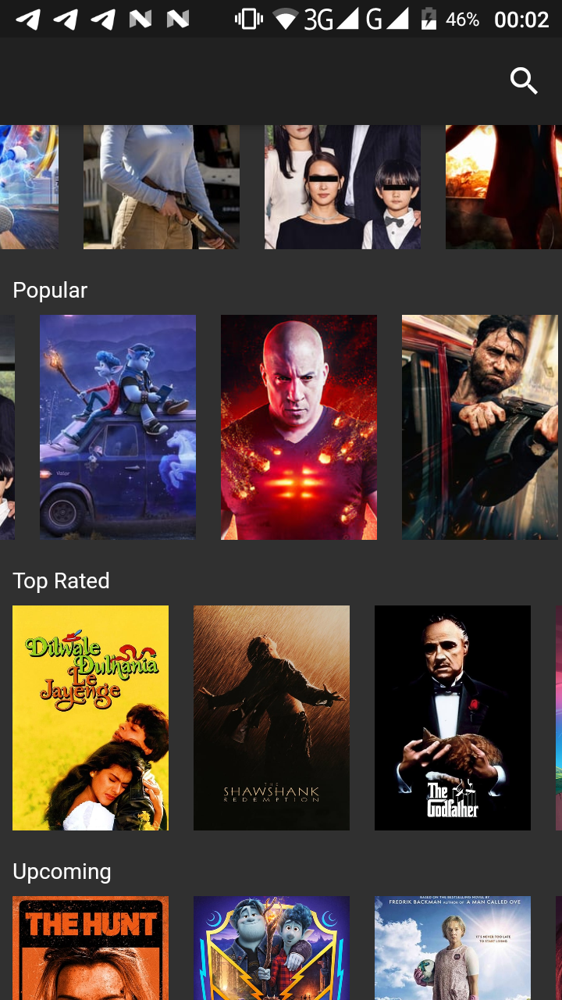
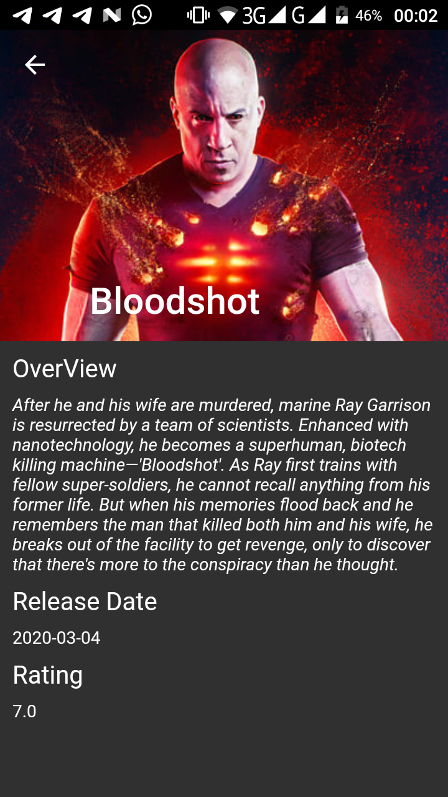

# MovieApp 

## Brief

This is a simple movie app built with flutter and the MVVM architecture 

## API

- [MoviesDB](https://developers.themoviedb.org/3/getting-started/introduction)

## Packages

- [Provider](https://pub.dev/packages/provider)
- [ProviderArchitecture](https://pub.dev/packages/provider_architecture)
- [Http](https://pub.dev/packages/http)

## Screenshots

